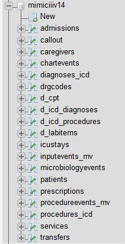
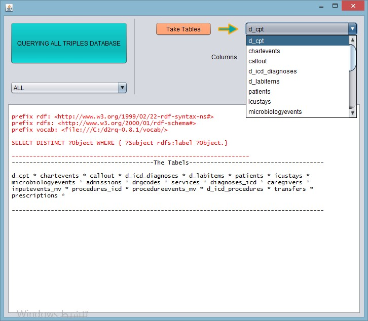
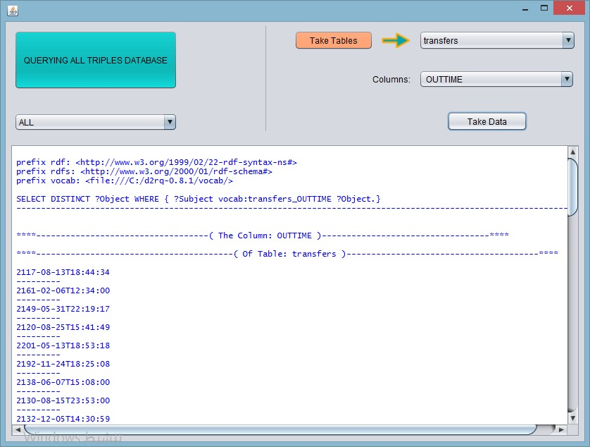

# java-sparql-query-app
master-thesis-java-application

# Java SPARQL Query Application

Dieses Projekt ist eine Java-basierte Anwendung, die im Rahmen meiner Masterarbeit entwickelt wurde.  
Es zeigt, wie Daten aus relationalen Datenbanken in das RDF-Format überführt und anschließend mit SPARQL über eine interaktive Java-Oberfläche abgefragt werden können.

Die Anwendung verwendet offene, anonymisierte Beispieldaten, die in einer MySQL-Datenbank gespeichert sind.  
Die Abbildung der relationalen Tabellen auf RDF erfolgt mithilfe der D2RQ-Plattform, während die Abfragen über Apache Jena ausgeführt werden.

## Funktionen
- Anbindung an eine relationale MySQL-Datenbank
- Abbildung relationaler Tabellen auf RDF mittels D2RQ
- Ausführung von SPARQL-Abfragen auf RDF-Daten
- Darstellung der Abfrageergebnisse in einer grafischen Java-Benutzeroberfläche
- Anzeige aller RDF-Triple sowie strukturierter Abfrageergebnisse

## Verwendete Technologien
- Java
- MySQL
- Apache Jena
- D2RQ
- SPARQL
- RDF

## Screenshots

### MySQL-Datenbankstruktur
Diese Abbildung zeigt das relationale Datenbankschema, das als Datenquelle dient.

.

### Abfrage der Tabellen mittels SPARQL
Diese Abbildung zeigt die Abfrage der relationalen Tabellen über SPARQL nach der RDF-Abbildung mithilfe von D2RQ.

### SPARQL-Abfrage von Spaltendaten
Diese Abbildung zeigt die Ausführung einer SPARQL-Abfrage sowie die Darstellung der Ergebnisse in der Anwendung.

## Hinweise
- Dieses Projekt wurde zu akademischen Zwecken entwickelt.
- Die verwendeten Daten sind öffentlich zugänglich und anonymisiert.
- Der Fokus liegt auf der Datenumwandlung und Abfrage, nicht auf dem UI-Design.

## Autor
Entwickelt von [Ali Abdulhameed/2019]
